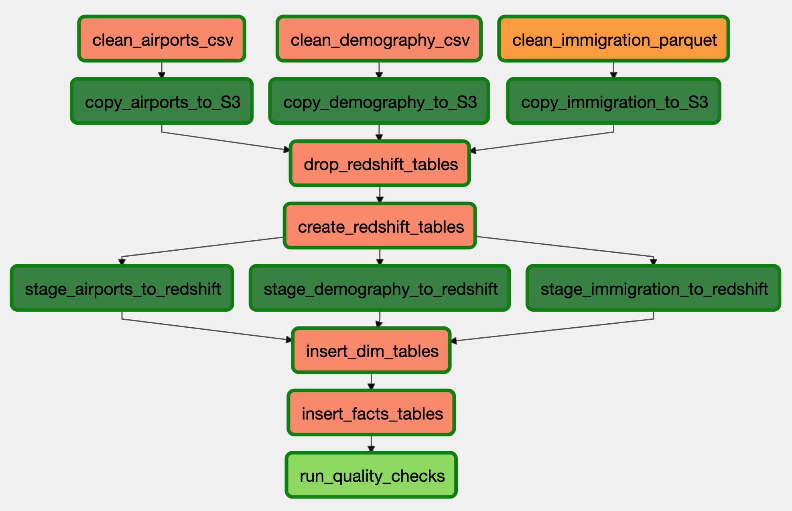
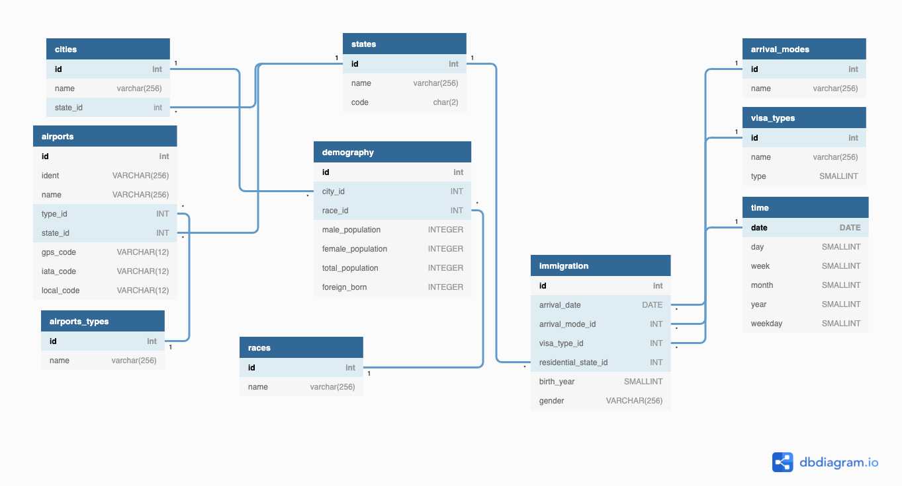

# US Demography and Immigration Data Pipeline

### Table of Contents
- [US Demography and Immigration Data Pipeline](#us-demography-and-immigration-data-pipeline)
    - [Table of Contents](#table-of-contents)
    - [Introduction](#introduction)
        - [Purpose](#purpose)
        - [Scope](#scope)
        - [ETL Summary](#etl-summary)
    - [Datasets](#datasets)
    - [Technologies/Tools](#technologiestools)
    - [Folder Structure](#folder-structure)
    - [Usage](#usage)
    - [Pipeline Workflow](#pipeline-workflow)
        - [Operators](#operators)
        - [Graph View](#graph-view)
        - [Tasks](#tasks)
    - [Data Diagram](#data-diagram)
    - [OLAP Query Exemples](#olap-query-exemples)
    - [Data Dictionary](#data-dictionary)
        - [Staging Tables](#staging-tables)
        - [Final Tables](#final-tables)
          - [Dimension Tables](#dimension-tables)
          - [Fact Tables](#fact-tables)
    - [Addressing Other Scenarios](#addressing-other-scenarios)
          - [Data increased by 100x](#data-increased-by-100x)
          - [Pipeline would run daily by 7am](#pipeline-would-run-daily-by-7am)
          - [Data accessed by 100+ users](#data-accessed-by-100-users)
    - [Contributors](#contributors)
    - [Credits](#credits)

### Introduction
##### Purpose
This project aims to provide a **Data Warehouse** where we can perform some analysis related to demography and immigration in different States of the USA.
With this Database, we can perform SQL queries to know the **Races**(Ethnic roups) dominating a given **City** of within a State, how many People migrated to a State, compare the immigration by arrival mode, knowing what **Visa type** was delivered the most, having a list of **Airports** found in a State, ...
##### Scope
The work is achieved by building a **Data Pipeline** which helps to clean data retrieved from our dataset found on-premise(locally), these data contain information about Cities demography, Airports, and Immigration, after cleaning data to our desired format, we send them to a bucket found in the cloud, from that bucket we copy them as staging tables to our database found in the cloud as well, then manipulate them to get fact and dimension tables.

##### ETL Summary
Orchestrated by **Apache Airflow**, the Pipeline works by cleaning Demography and Airports **CSV** data with **Pandas**, clean Immigration **Parquet** data with **Spark**, move to an **S3** bucket, then bring data to the **Redshift** warehouse.

### Datasets
Our project contains 3 data sources
*   Above `2.8k` records related to **Demography** data found in a **csv** file `data/raw/demography/us-cities-demographics.csv`
*   Above `55K` records with **Airports** data found in a **csv** file `data/raw/airports/airport-codes_csv.csv`
*   Above `2M` records related to **Immigration** data found in **parquet** files `data/raw/immigration/parquet`

Above data were obtain from the [Udacity Data Engineering Program](https://www.udacity.com/course/data-engineer-nanodegree--nd027)'s **Capstone Project**.
### Technologies/Tools
* [Python 3](https://www.python.org/)(*Programming Language*) - Besides being one of the most popular programming languages and easy to learn, many Data Engineering Libraries are available for this language and some of the tools we will use are only available in Python and it's among the favorite languages in the industry.
* [Apache Airflow](https://airflow.apache.org/)(*Workflow Tool*) - Apache Airflow is not only a great and popular workflow tool, it also comes with many integrations with popular services we might need.
* [Pandas](https://pandas.pydata.org/)(*Data manipulation Library*) - As a great tool for data manipulation, Pandas will help us to easily manipulate or CSV data. 
*  [Spark](https://spark.apache.org/docs/latest/api/python/)(*Large Data Processing Tool*) - Being a fast engine for large-scale data processing, We'll use the Python Library of Spark to clean our Immigration Data since we expect to retrieve massive data related to immigration.
* [S3](https://aws.amazon.com/s3/)(*Storage Service*) - Since our final data are stored on an AWS product, we opted to have the data transitioned by an AWS bucket as well because of easy interoperability between them and also having both in the same region for fast readability.
* [Redshift](https://docs.aws.amazon.com/redshift/latest/mgmt/welcome.html)(*Data Warehouse Service*) - As our Warehouse is meant to contain millions of records, Redshift is a good fit for our data warehouse, since it's designed for large-scale data and on top of that it records data in columnar based which guaranty fast read compared to row-based; Redshift is good for fast read while performing OLAPs operations on our Data Warehouse.

### Folder Structure

    .
    ├── dags                                            # Airflow DAG files
    ├── data                                            # Data to work with
        ├── cleaned                                     # Processed data with Pandas / Spark
        ├── raw                                         # Unprocessed data
            ├── airports
            ├── demography
            ├── immigration
    ├── img                                             # Images files used in the README.md
    ├── plugins                                         # Airflow's plugins
        ├── helpers
            ├── files_definitions                       # Informations about files to be processed
            ├── sql                                     
                ├── queries                             # SQL queries
                ├── tables_definitions                  # Descriptions of SQL tables
        ├── operators                                   # Custom Airflow Operators
    ├── scripts                                         
    ├── .gitignore
    ├── README.md
    └── requirements.txt                                #  Python packages to be installed

### Usage
This app requires having [**Spark**(*Pyspark*)](https://spark.apache.org/docs/latest/api/python/) and [**Airflow**](https://airflow.apache.org/) installed and configured. 

> If you are running the app outsited the Airflow's default folder, you will need to change the values of `dags_folder` and `plugins_folder` found in `/Users/<user-name>/airflow/airflow.cfg` file.

Additionnaly,  you need to add Airflow connections to your AWS as `aws_credentials` (**aws** connection type) and your Redshift Connection as `redshift`(**postgres** connection type), and an Airflow variable `s3_bucket` to contain the bucket name.

*   **Step 1**
```sh
$ #cd to the project home directory/folder
$ python3 -m venv /path/to/new/virtual/environment # Optional: Creating a virtual environment
$ source your-venv/bin/activate # If you are using a virtual environment
$ airflow scheduler 
$ airflow webserver
```
*   **Step 2**
Open your Airflow Web page eg: `http://0.0.0.0:8080`
Activate the DAG `us_demography_and_immigration` and start it if it's not running yet.


### Pipeline Workflow

##### Operators
* **PandasCleanCsvOperator**
    Used to clean **CSV** data with **Pandas**, the Operator receives:
        `source_directory_path`, location of files to be cleanned
        `destination_directory_path`, destination of cleaned data in CSV format
        `data_definition`, a dictionnary helping to customize the csv file, with this, we can select desired columns, rename them, replace not a number with a custom value, convert data types of our columns
        `delimiter`, the delimiter of the files to be cleaned
* **LoadToS3Operator**
    Used to send files from our local environment to AWS **S3**, the Operator receives:
        `local_directory`, location of files to be sent
        `s3_directory`, S3 directory to where data will be sent
        `s3_bucket`, the S3 bucket to be used
        `file_formats`, a list of file formats to be sent, this helps to ignore some files found in our dictory
* **S3ToRedshiftOperator**
    Used to copy data from AWS **S3** to staging tables found in AWS **Redshift**, the Operator receives:
        `redshift_conn_id`, Redshift connection ID found in Airflow's connections
        `aws_credentials_id`, AWS credentials found in Airflow's connections
        `table`, the Staging table where data will be copied, it is a dictionnary having information about the table and also the s3 data to be copied
        `s3_directory`, directory to copy from
        `s3_bucket`, the S3 bucket where data is found
* **RedshifQueriesOperator**
    Operator to run queries on AWS **Redshift**, it receives:
        `redshift_conn_id`, Redshift connection ID found in Airflow's connections
        `query_list`, list of queries to be run
        `query_type`, type of queries to be run
        `append_data`, a boolean; if **False** and **query_type** is **insert**, the table is emptied before inserting new records.
* **DataQualityOperator**
    Operator to check data quality  on AWS **Redshift** final tables, this operator checks for minimum records and null value in given columns, it receives:
        `redshift_conn_id`, Redshift connection ID found in Airflow's connections
        `tables_list`, list of tables to check the quality, the tables are dictionnary containing details about data quality to be run

##### Graph View


##### Tasks
* Clean Demography **CSV** Data with **Pandas** (*task_id='clean_demography_csv'*)
    Uses **PandasCleanCsvOperator** to clean Demographic data, the task uses data found in `helpers/files_definitions` 
* Clean Airports **CSV** Data with **Pandas** (*task_id='clean_airports_csv'*)
    Uses **PandasCleanCsvOperator** to clean Airports data, the task uses data found in `helpers/files_definitions`
* Clean Immigration **Parquet** Data with **Spark** (*task_id='clean_immigration_parquet'*)
    Uses Airflow's **SparkSubmitOperator** to clean Airports Immigration data, it runs the Spark script `scripts/immigration/spark_immigration.py`
* Copy Demography to **S3** (*task_id='copy_demography_to_S3'*)
    Uses **LoadToS3Operator** to send our cleaned Demographic csv data to S3
* Copy Airports to **S3** (*task_id='copy_airports_to_S3'*)
    Uses **LoadToS3Operator** to send our cleaned Airports csv data to S3
* Copy immigration to **S3** (*task_id='copy_immigration_to_S3'*)
    Uses **LoadToS3Operator** to send our cleaned immigration parquet data to S3, since the directory contains other files that can't be read by Redshift, `file_formats=['parquet']` helps to only send file ending with `parquet`
* Drop **Redshift** tables (*task_id='drop_redshift_tables'*)
    Sends values from `plugins/helpers/sql/queries/drop_tables.py` to the **RedshifQueriesOperator** to drop redshift tables
* Create **Redshift** tables (*task_id='create_redshift_tables'*)
    Sends values from `plugins/helpers/sql/queries/create_tables.py` to the **RedshifQueriesOperator** to create redshift tables
* Stage Demography to **Redshift** (*task_id='stage_demography_to_redshift'*)
    Sends values from `helpers/sql/tables_definitions/staging.py` to the **S3ToRedshiftOperator** to copy data from S3 to `staging_demography` table
* Stage Airports to **Redshift** (*task_id='stage_airports_to_redshift'*)
    Sends values from `helpers/sql/tables_definitions/staging.py` to the **S3ToRedshiftOperator** to copy data from S3 to `staging_airports` table
* Stage Immigration to **Redshift** (*task_id='stage_immigration_to_redshift'*)
    Sends values from `helpers/sql/tables_definitions/staging.py` to the **S3ToRedshiftOperator** to copy data from S3 to `staging_immigration` table
* Insert **Redshift** Dimmension tables (*task_id='insert_dim_tables'*)
    Sends a list of Dimmension talbes Insert Queries from  `plugins/helpers/sql/queries/insert` to  **RedshifQueriesOperator**
* Insert **Redshift** Facts tables (*task_id='insert_facts_tables'*)
    Sends a list of Facts tables Insert Queries from  `plugins/helpers/sql/queries/insert` to  **RedshifQueriesOperator**
* Run Quality Check on **Redshift** Dimmension and Fact tables (*task_id='run_quality_checks'*)
    Sends a list of thw tables found in  `plugins/helpers/sql/tables_definitions` to  **RedshifQueriesOperator**


### Data Diagram
The diagram represents relationship between our final tables
-  **Dimension Tables** 
    `states, cities, races, airports_types, airports, arrival_modes, visa_types, time`
-  **Fact Tables** 
    `immigration, demography`



### OLAP Query Exemples
We can run many analytical queries on our database. Following are few of the exemples
-  **Count delivered visa per type** 
    `SELECT vt.name, count(imm.*) FROM immigration imm
    INNER JOIN visa_types ON imm.visa_type_id = vt.id
    GROUP BY vt.name `

-  **Get Small Airports found in a State X** eg: `'NY'`
    `SELECT states.code AS state_code, type.name AS airport_type, airp.*  FROM airports airp
    INNER JOIN airports_types type ON airp.type_id = type.id
    INNER JOIN states  ON airp.state_id = states.id
    WHERE states.code = 'NY' AND type.name = 'small_airport'`

### Data Dictionary

##### Staging Tables

-  **staging_demography** 
    Data copied from our demography CSV file to Redshift

| Column | Datatype | Constrainct | Description |
| ------ | ------ |------ | ------ |
| city | VARCHAR(256) |  | City name, eg `Los Angeles` |
| state | VARCHAR(256) | | Name of the airport , eg: `New York` |
| male_population | INTEGER | |  |
| female_population | INTEGER | |  |
| total_population | INTEGER |  |  |
| foreign_born | INTEGER |  |  |
| state_code | VARCHAR(256) | | local code of the airport , eg: `NY` |
| race | VARCHAR(256) | | Ethnic group , eg: `Black or African-American` |

-  **staging_airports** 
    Data copied from our airport CSV file to Redshift

| Column | Datatype | Constrainct | Description |
| ------ | ------ |------ | ------ |
| ident | VARCHAR(256) |  | Identity number of the airport, eg `03OR` |
| name | VARCHAR(256) | | Name of the airport , eg: `Zink Airport` |
| type | VARCHAR(256) | | String representing the Airport Type  |
| iso_region | VARCHAR(256) | | ISO Code representing the State, eg: `US-NY`  |
| gps_code | VARCHAR(256) |  | GPS code of the airport |
| iata_code | VARCHAR(256) |  | IATA code of the airport , eg: `UTK` |
| local_code | VARCHAR(256) | | local code of the airport , eg: `06GA` |

-  **staging_immigration** 
    Data copied from our immigration Parquet files to Redshift

| Column | Datatype | Constrainct | Description |
| ------ | ------ |------ | ------ |
| arrival_date | DATE |  |  eg `2016-04-16` |
| arrival_mode | VARCHAR(256) | |  eg: `Air` |
| visa_type | SMALLINT | | eg: `2` |
| birth_year | SMALLINT | | eg: `1978` |
| gender | VARCHAR(256) |  |  |
| residential_state | VARCHAR(256) |  | Code of the State representing the address of the Immigrant, eg: `NY` |

#####  Final Tables

###### Dimension Tables
-  **states**  (*diststyle all, sortkey(code)*)
    Table representing different States of the USA, data is retrieved from `staging_demography` table

| Column | Datatype | Constrainct | Description |
| ------ | ------ |------ | ------ |
| id | INT |IDENTITY(1,1) PRIMARY KEY| Auto generated ID number for each state record  |
| name | VARCHAR(256) |NOT NULL UNIQUE | Name of the State, eg: `New York` |
| code | CHAR(2) | UNIQUE| Fixed 2 charaters representing the state Code, eg: `NY`  |

-  **cities**  (*diststyle all, compound sortkey(name, state_id)*)
    Table representing Cities in the USA found in our demographic data, data is retrieved from `staging_demography` and `states` tables

| Column | Datatype | Constrainct | Description |
| ------ | ------ |------ | ------ |
| id | INT |IDENTITY(1,1) PRIMARY KEY| Auto generated ID number for each city record  |
| name | VARCHAR(256) |NOT NULL UNIQUE | Name of the City, eg: `Los Angeles` |
| state_id | INT | foreign key(state_id) references states(id)| ID record reference of the state in which the city belongs  |

-  **races**  (*diststyle all, sortkey(name)*)
    Table representing Ethnic groups in the USA found in our demographic data, data is retrieved from `staging_demography` table

| Column | Datatype | Constrainct | Description |
| ------ | ------ |------ | ------ |
| id | INT |IDENTITY(1,1) PRIMARY KEY| Auto generated ID number for each race record  |
| name | VARCHAR(256) |NOT NULL UNIQUE | Name of the ethnic group , eg: `Black or African-American` |

-  **airports_types**  (*diststyle all, sortkey(name)*)
    Table representing Different Airport Types in the USA found in our airports data source, data is retrieved from `staging_airports` table

| Column | Datatype | Constrainct | Description |
| ------ | ------ |------ | ------ |
| id | INT |IDENTITY(1,1) PRIMARY KEY| Auto generated ID number for each record  |
| name | VARCHAR(256) |NOT NULL UNIQUE | Name of the airport type , eg: `small_airport` |

-  **airports**  (*diststyle all, compound sortkey(name, type_id)*)
    Table representing Different Airports in found in our USA airports data source, data is retrieved from `staging_airports`, `states` , and `airports_types` tables

| Column | Datatype | Constrainct | Description |
| ------ | ------ |------ | ------ |
| id | INT |IDENTITY(1,1) PRIMARY KEY| Auto generated ID number for each record  |
| ident | VARCHAR(256) |  | Identity number of the airport, eg `03OR` |
| name | VARCHAR(256) |NOT NULL UNIQUE | Name of the airport , eg: `Zink Airport` |
| type_id | INT | foreign key(type_id) references airports_types(id)| ID record reference of the airport type  |
| state_id | INT | foreign key(state_id) references states(id)| ID record reference of the state in which the airport is found  |
| gps_code | VARCHAR(12) | UNIQUE | GPS code of the airport |
| iata_code | VARCHAR(12) | UNIQUE | IATA code of the airport , eg: `UTK` |
| local_code | VARCHAR(12) | UNIQUE | local code of the airport , eg: `06GA` |

-  **arrival_modes**  (*diststyle all, sortkey(name)*)
    Table representing Different Arrival Modes recorded in our Immigration data source, data is retrieved from `staging_immigration` table

| Column | Datatype | Constrainct | Description |
| ------ | ------ |------ | ------ |
| id | INT |IDENTITY(1,1) PRIMARY KEY| Auto generated ID number for each record  |
| name | VARCHAR(256) |NOT NULL UNIQUE | Name of the arrival mode , eg: `Air` |

-  **visa_types**  (*diststyle all, compound sortkey(type, name)*)
    Table representing Different Visa Types recorded in our Immigration data source, data is retrieved from `staging_immigration` table

| Column | Datatype | Constrainct | Description |
| ------ | ------ |------ | ------ |
| id | INT |IDENTITY(1,1) PRIMARY KEY| Auto generated ID number for each record  |
| name | VARCHAR(256) |NOT NULL UNIQUE | Name of the visa type , eg: `Business` |
| type | SMALLINT |NOT NULL | Number representing the of the visa type , eg: `1` |

-  **time**  (*diststyle all, sortkey(date)*)
    Table representing Different All the arrival dates recorded in our Immigration data source, data is retrieved from `staging_immigration` table

| Column | Datatype | Constrainct | Description |
| ------ | ------ |------ | ------ |
| date | DATE |PRIMARY KEY | eg: `2016-04-30` |
| day | INT |NOT NULL | eg: `30` |
| week | INT |NOT NULL |  |
| month | INT |NOT NULL | eg: `4` |
| year | INT |NOT NULL | eg: `2016` |
| weekday | INT |NOT NULL |  |

###### Fact Tables

-  **demography**  (*diststyle all, compound sortkey(city_id, race_id)*)
    Table representing Demographic records in our Demography data source, data is retrieved from `staging_demography`, `cities`, and `races` tables

| Column | Datatype | Constrainct | Description |
| ------ | ------ |------ | ------ |
| id | INT |IDENTITY(1,1) PRIMARY KEY| Auto generated ID number for each record  |
| city_id | INT | NOT NULL foreign key(city_id) references cities(id)| ID record reference of the City  |
| race_id | INT | NOT NULL foreign key(city_id) references cities(id)| ID record reference of the Ethnic Group  |
| male_population | INT | | Number of recorded Male Population |
| female_population | INT | | Number of recorded female Population |
| total_population | INT | | Number of total population |
| foreign_born | INT | | Number of foreign born |

-  **immigration**  (*distkey(residential_state_id), compound sortkey(arrival_date, residential_state_id)*)
    Table representing Immigration records retrieved from our Immigration data source, data is retrieved from `staging_immigration`, `states`, `time`, `arrival_modes`, and `visa_types` tables

| Column | Datatype | Constrainct | Description |
| ------ | ------ |------ | ------ |
| arrival_date | DATE | NOT NULL foreign key(arrival_date) references time(date)| Date of arrival  |
| arrival_mode_id | INT | foreign key(arrival_mode_id) references arrival_modes(id)| ID record reference to the arrival mode  |
| visa_type_id | INT |foreign key(visa_type_id) references visa_types(id) | ID record reference to the visa type  |
| residential_state_id | INT |foreign key(residential_state_id) references states(id) | ID record of the State representing the address of the Immigrant |
| birth_year | SMALLINT | | Birth Year of the Immigrant |
| gender | VARCHAR(256) | | Gender of the Immigrant |

### Addressing Other Scenarios

###### Data increased by 100x
If data is increased by 100x we will consider using some cloud services based ressources such as AWS **EMR** to run jobs related to clean data before sending to the Warehouse instead of running locally, cloud Services provide many solutions where we can use more compute power with less cost and less worry about the system availability and maintainability.

###### Pipeline would run daily by 7am
If We receive Update on daily basis, the main change on our ETL process will be adding data increamently (*appending*) instead of cleaning data before loading new records, we will also find a way to be updating existing records incase the recent data contain their updates 

###### Data accessed by 100+ users
The warehouse service (Redshift) is built to handle huge traffics, having hundred + users won't affect our system but we can consider to restructure how data is distributed based on the users regions so that it will help them to retrieve data quickly. 

### Contributors
**Joël Atiamutu** *[github](https://github.com/joelatiam)  [gitlab](https://gitlab.com/joelatiam)*

### Credits
**[Udacity Data Engineering Program](https://www.udacity.com/course/data-engineer-nanodegree--nd027)**

